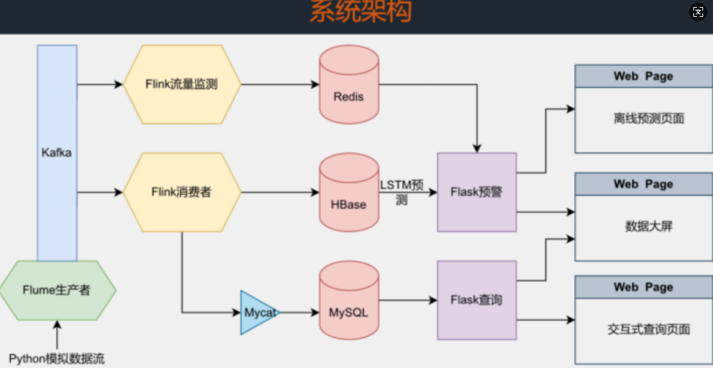

### 课设项目策划书：《高速公路实时车流监控与套牌车预警平台》

#### 1. 🎯 项目概述

本项目旨在利用深圳市的高速公路卡口过车数据（来自你上传的 `交通流量数据字段说明.png`），构建一个集**数据存储、实时监控、交互查询、实时预警**于一体的大数据管理平台。

我们将复用往届学长的经典技术架构（Flume+Kafka+Flink），但**业务逻辑将完全围绕我们的“卡口数据”和“套牌车检测”扩展要求展开**。

**核心功能：**

- **数据大屏**：动态展示全市车流、卡口流量排名、24小时流量曲线、车辆来源地图炮。
- **交互查询**：按卡口、车牌、时间等多维度组合查询过车记录。
- **实时预警 (项目亮点)**：实时检测“同一车牌在短时间内出现在不同卡口”的套牌车嫌疑行为。

#### 2. 💻 核心技术栈

- **数据采集**：Python (模拟数据流), Flume (日志采集)
- **数据缓存**：Kafka (消息队列)
- **数据存储**：MySQL 5.7 (单机主从/虚拟节点), MyCat (分库分表中间件), Redis (实时预警缓存)
- **实时计算**：Flink (数据清洗、实时预警)
- **离线计算**：Spark ML (流量预测模型训练)
- **后端服务**：Python Flask (提供 API 接口)
- **前端展示**：Vue / React (任选其一), Echarts (可视化图表)

#### 3. 👥 4人团队分工 (RACI)

| **角色**            | **负责人** | **核心职责 (Responsible)**                                   | **关键交付物**                                               |
| ------------------- | ---------- | ------------------------------------------------------------ | ------------------------------------------------------------ |
| **前端总负责**      | **我**     | 1. 制定 API 规范 2. 开发数据大屏 3. 开发交互式查询页面       | 1. API 接口文档 (v1.0) 2. Vue/React 前端项目                 |
| **数据管道工**      | **同学A**  | 1. 模拟实时数据流 2. 搭建 Flume -> Kafka 管道 3. 运维 ZK 和 Kafka 集群 | 1. `simulate.py` 脚本 2. `flume.conf` 配置文件 3. 稳定的 Kafka Topic (`traffic-raw`) |
| **后端与存储 (主)** | **同学B**  | 1. 搭建 MyCat+MySQL (单机主从) 2. Flink 消费数据入库 MyCat 3. 开发“业务类” Flask API | 1. `schema.xml` (MyCat配置) 2. Flink to MyCat (Java/Scala) 3. Flask API (业务) |
| **算法与预警 (辅)** | **同学C**  | 1. Flink 实时检测套牌车 2. 训练 Spark ML 预测模型 3. 开发“算法类” Flask API | 1. Flink to Redis (Java/Scala) 2. Spark ML 模型文件 3. Flask API (算法) |

#### 4. 🛰️ 基础设施部署方案 (2台服务器 - 虚拟节点版)

我们采用老师建议的**2服务器方案**，使用“虚拟节点”满足主从要求。

| **服务器**   | **命名**        | **运行的服务 (负责人)**                                      | **配置建议**                                       |
| ------------ | --------------- | ------------------------------------------------------------ | -------------------------------------------------- |
| **服务器 1** | `pipeline-algo` | **Zookeeper** (A) **Kafka** (A) **Flume** (A) **Flink** (B, C) **Redis** (C) **Spark** (C) **Flask (算法API)** (C) | **(高内存)** 8核 16G+ 负责所有数据接入和实时计算。 |
| **服务器 2** | `db-app`        | **MySQL (主库) @ 3306** (B) **MySQL (从库) @ 3307** (B) **MyCat @ 8066** (B) **Flask (业务API) @ 5000** (B) | **(高内存)** 8核 16G+ 负责数据库(主从)和业务API。  |

#### 5. 📖 详细执行计划 (Step-by-Step)

##### 阶段 0：项目“握手协议” (第1天，你)

- **目标**：定义前后端“契约”，实现解耦。
- **行动 (你)**：你作为前端，**必须立刻**编写一份 API 接口文档（Markdown/Word），发给同学 B 和 C。
- **文档内容 (v1.0 示例)**：
  1. `POST /api/query` (B负责): 交互式查询。
  2. `GET /api/stats/kkmc_count` (B负责): 大屏-卡口流量 Top 10。
  3. `GET /api/stats/hour_count` (B负责): 大屏-24小时流量曲线。
  4. `GET /api/stats/map_data` (B负责): 大屏-行政区划流量。
  5. `GET /api/warnings/realtime` (C负责): 大屏-实时套牌车告警（10条）。
  6. `GET /api/predict/flow` (C负责): 大屏-未来1小时流量预测。
- **参考资料**：
  - **刘冰峰**的报告 (`刘冰峰-前端.pdf`, 第 9-12 页) 展示了他（前端）需要后端提供哪些数据（如 `left-bottom`, `right-top`, `center-map`）。
  - **朱少行**的报告 (`朱少行-后端.pdf`, 第 9-13 页) 展示了他（后端）是如何设计 API (如 `solution` 类) 来满足前端需求的。

##### 阶段 1：数据管道打通 (第1-3天，同学A)

- **目标**：提供一个稳定的 Kafka Topic (`traffic-raw`)，每秒产生50条数据。
- **行动 (同学A)**：
  1. **数据准备**：将 `202312` 和 `202401` 文件夹下的所有 CSV/XLSX 文件合并为一个 `master_data.csv`。
  2. **模拟脚本 (`simulate.py`)**：
     - 用 Python `pandas` 读取 `master_data.csv`。
     - 循环读取每一行，**将其中的 `GCSJ` (过车时间) 替换为“当前系统时间”**。
     - 将该行数据（如 `GCXH\tXZQHMC\t...`）追加写入 `/var/log/traffic.log`。
     - `time.sleep(1.0 / 50.0)` 控制速率。
     - 后台运行：`nohup python simulate.py &`
  3. **Flume 配置 (`flume.conf`)**：
     - **Source**: `TAILDIR`，监控 `/var/log/traffic.log`。
     - **Channel**: `memory`。
     - **Sink**: `KafkaSink`，`kafka.topic = traffic-raw`，`kafka.bootstrap.servers = pipeline-algo:9092`。
  4. **启动服务**：在 `pipeline-algo` 服务器上启动 Zookeeper, Kafka, Flume。
- **参考资料**：
  - **杨研博**的报告 (`杨研博-数据管道.pdf`) 是这个阶段的“圣经”。
  - **第 9-11 页**：有他编写 `input_logs.py` 和 `single_log.py` 脚本的完整心路历程，包括如何解决序号 (`XH`) 递增问题。
  - **第 13 页**：有他配置 Flume (`file2kafka.conf`) 的完整脚本。
  - **第 4-7 页**：有他解决 Zookeeper 和 Kafka 各种环境报错（如 `quorumListenOnALLIPs=true`）的宝贵经验。

##### 阶段 2：后端存储与业务 API (第2-7天，同学B)

- **目标**：将数据存入 MyCat，并提供业务查询 API。
- **行动 (同学B)**：
  1. **搭建数据库 (虚拟节点)**：在 `db-app` 服务器上，通过“单机多实例”的方式安装并配置**两个** MySQL 5.7 节点（**不要用8.0**）。一个作主库 (如 `3306` 端口)，一个作从库 (如 `3307` 端口)。这是老师提到的“两个虚拟节点”。
  2. **配置 MyCat (`schema.xml`)**：
     - 在 `db-app` 上安装 MyCat。
     - 定义两个 `dataNode` (主库、从库)，`host` 都指向 `127.0.0.1`（或 `db-app` 的IP），但 `port` 分别为 `3306` 和 `3307`。
     - **核心 (分片规则)**：创建 `traffic_data` 逻辑表。分片规则 `sharding-by-murmur`，分片键 `column="KKMC"` (卡口名称)。
     - 创建 `cp_map` 全局表 (车牌前缀 -> 省份)，用于地图炮。
  3. **Flink 消费 (Java/Scala)**：
     - 在 `pipeline-algo` 上编写 Flink 作业。
     - **Source**: `FlinkKafkaConsumer`，订阅 `traffic-raw`。
     - **Transform**: `flatMap`，按 `\t` 切割日志字符串，解析为 `TrafficEvent` 对象。
     - **Sink**: `addSink(new MysqlConnect())`。使用 Druid 连接池 和 JDBC，将数据批量写入 MyCat (端口 `8066`)。
  4. **Flask API (`/api/stats/\*`, `/api/query`)**：
     - 在 `db-app` 上启动 Flask 服务 (端口 `5000`)。
     - **查询接口**: 动态拼接 SQL，连接 MyCat 执行 `SELECT`（如 `SELECT * FROM traffic_data WHERE KKMC = ? AND HPHM LIKE ?`）。
     - **统计接口**: 编写 `GROUP BY` 聚合 SQL（如 `SELECT KKMC, COUNT(*) FROM traffic_data GROUP BY KKMC`）。
     - **跨域**：**必须**安装 `flask-cors` 并启用，否则“你”的前端无法访问。
- **参考资料**：
  - **朱少行**的报告 (`朱少行-后端.pdf`)：
    - **第 3-8 页**：MyCat 和 MySQL 5.7 的安装、配置、主从复制、分片规则 (`sharding-by-murmur`)、全局表 (`cp_map`)。你需要把他的 `dataNode` 配置改为指向 `db-app:3306` 和 `db-app:3307`。
    - **第 9-13 页**：Flask API 的核心代码，特别是**增量查询 (`solution` 类)**和**交互式查询 (`utils` 类)**的实现。
    - **第 13-16 页**：解决 MyCat 并发问题（延时查询）和 MySQL 8.0 坑的总结。
  - **杨研博**的报告 (`杨研博-数据管道.pdf`)：
    - **第 15-18 页**：Flink 消费 Kafka 并 Sink 到 MyCat 的 Java 代码，**尤其是 Druid 连接池的配置**。

##### 阶段 3：算法预警与预测 (第2-7天，同学C)

- **目标**：实现套牌车检测和流量预测，并提供 API。
- **行动 (同学C)**：
  1. **Flink 实时预警 (Java/Scala)**：
     - 在 `pipeline-algo` 上编写 Flink 作业。
     - **Source**: `FlinkKafkaConsumer`，订阅 `traffic-raw`。
     - **Transform (核心)**：
       - `keyBy( HPHM )` // 按车牌号分组
       - 使用 `ProcessFunction` (Flink 状态编程)。
       - 定义状态：`ValueState<Tuple2<String, Long>> lastSeenState;` // (上次卡口, 上次时间)
       - **处理逻辑**：
         1. 新数据 `event` 来了，获取 `last = lastSeenState.value()`。
         2. `if (last != null && !event.KKMC.equals(last.f0) && (event.Time - last.f1 < 300000))` // 5分钟内 & 不同卡口
         3. `out.collect("车牌 " + event.HPHM + " 疑似套牌！")` // 输出告警
         4. `lastSeenState.update(Tuple2.of(event.KKMC, event.Time))` // 更新状态
     - **Sink**: `addSink(new FlinkRedisSink(...))`。将告警字符串 `LPUSH` 到 Redis (在 `pipeline-algo` 上) 的 `traffic:warnings` 列表。
  2. **Spark ML 离线预测**：
     - 使用 `master_data.csv`，用 Spark ML 训练一个流量预测模型（如线性回归）。
     - 特征：`KKMC`, `Hour` (小时)，目标：`Flow` (流量)。
     - 保存模型文件 `traffic_model`。
  3. **Flask API (`/api/warnings/\*`, `/api/predict/\*`)**：
     - 在 `pipeline-algo` 上启动 Flask 服务 (端口 `5001`)。
     - **预警接口**: `LRANGE traffic:warnings 0 10`，从 Redis 读取最新10条告警。
     - **预测接口**: 加载 `traffic_model`，接收（卡口, 小时）参数，返回预测值。
     - **跨域**：同样必须启用 `flask-cors`。
- **参考资料**：
  - **杨再润**的报告 (`杨再润-组长.pdf`)：
    - **第 3-4 页**：Flink 实时计算（`Flink 统计实时车流量并报警`）和 Sink 到 **Redis** 的思路。
    - **第 7 页**：Flask 后端 API 接口（`Flask 后端接口`）的设计，为算法模型提供服务。
    - **第 8-9 页**：解决云服务器部署 HDFS/HBase 问题的 **Docker 方案**（如果 C 想用 HBase 存数据，这页必看）。
  - **（我们的扩展）**：学长做的是 LSTM 预测，我们按课设要求用 Spark ML，这部分需要 C 自己探索，但 API 服务部分可完全参考**杨再润**。

##### 阶段 4：前端集成与联调 (第3-10天，你)

- **目标**：开发 UI，并在“握手协议”指导下完成联调。
- **行动 (你)**：
  1. **Mock 开发**：在同学 B/C 完成 API 前，你使用本地 `db.json` 或 `Mock.js` 模拟 API 返回值，独立开发前端页面。
  2. **大屏开发**：
     - 使用 Echarts 绘制地图、柱状图、饼图、折线图。
     - 设置 `setInterval` 定时器，每30秒调用一次 B 和 C 的所有 API，刷新图表。
  3. **查询页开发**：
     - 制作查询表单，使用下拉框和日期选择器。
     - 提交时，调用 B 的 `POST /api/query` 接口。
     - 实现前端分页，点击页码时，重新调用 API 并传入 `page` 参数。
  4. **联调**：
     - 将 Mock 数据的 URL 替换为真实的服务器 API 地址（`http://db-app:5000/...` 和 `http://pipeline-algo:5001/...`）。
     - 解决跨域问题（提醒 B/C 开启）。
     - 解决数据格式不一致问题（参照 API 文档）。
- **参考资料**：
  - **刘冰峰**的报告 (`刘冰峰-前端.pdf`)：
    - **第 5-17 页**：学习他如何从0开始选型（`go-view`）、如何定义数据格式、如何解决跨域（CORS）、如何解决图表抖动和数据“卡壳”（与后端联调）问题。
  - **高壬成**的报告 (`高成-前端.pdf`)：
    - **第 4-7 页**：学习他如何搭建 Vue 页面、如何从“前端查询”重构为“后端查询”、如何实现动态条件、分页和便捷时间查询。

------

#### 6. ⚠️ 关键解耦点 (必须遵守)

1. **Kafka Topic (A -> B, C)**：同学 A 必须保证 `traffic-raw` 主题稳定，并明确告知 B 和 C 数据的**确切格式**（如：`"字段1\t字段2\t字段3"`）。
2. **API 文档 (你 -> B, C)**：我（前端）必须**在第1天**提供 API 规范。这是 B 和 C 的开发指南，也是你 Mock 数据的依据。

按照这个策划案，我们4个人可以最大程度地**并行工作**，A 是 B、C 的上游，B、C 互不干扰，我（前端）通过 API 协议与 B、C 解耦。